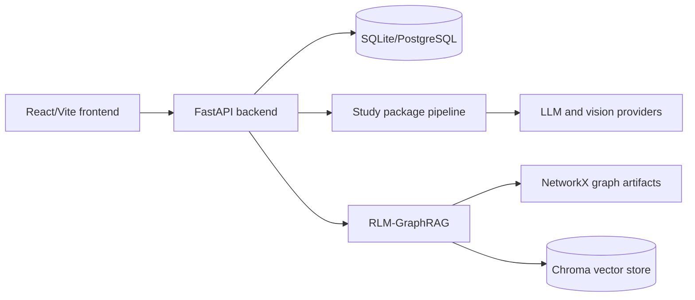

# master_eduRAG

master_eduRAG is a unified educational RAG platform that combines Studymines-style adaptive study package generation with an RLM-GraphRAG cognitive core. Students and teachers can upload documents or images, generate summaries/flashcards/questions, build knowledge graph artifacts, ask graph-grounded questions, manage classrooms, create course structures, assign assessments, and inspect mastery/risk analytics.

Live demo: <!-- TODO: verify --> `https://example.com/master-edurag`

## Tech Stack

- Backend: FastAPI `>=0.110`, Uvicorn, SQLAlchemy `>=2.0`, PyJWT, bcrypt/passlib
- Database: SQLite by default, PostgreSQL via `DATABASE_URL`
- Frontend: React `18.2`, Vite `8`, React Router `7`, axios, Tailwind CSS `3.3`, Framer Motion, lucide-react
- AI/ML: Google Generative AI, Groq, Ollama, OpenAI, Anthropic, Cerebras, Torch, Transformers, sentence-transformers, spaCy
- Graph/vector: NetworkX `>=3.2`, ChromaDB, cdlib/leidenalg/igraph
- Parsing/OCR: PyMuPDF, python-docx, python-pptx, marker-pdf, docling, OpenCV, Pillow, PaddleOCR
- Testing: pytest, pytest-asyncio, Vitest, React Testing Library

## Architecture

The React frontend talks to a single FastAPI backend over `/api/v1` and websocket chat routes. FastAPI persists relational data with SQLAlchemy, stores files under `data/uploads`, and sends extracted text through parsing, study package generation, and GraphRAG enrichment.



Full diagram: [docs/diagrams/architecture.md](docs/diagrams/architecture.md).

## Prerequisites

- Python 3.11+
- Node.js and npm
- Optional Ollama for local RAG generation
- Provider API keys for any cloud LLM/OCR path you enable

## Environment Setup

Copy `.env.example` to `.env` and set real values.

| Name | Description | Required | Example |
|---|---|---:|---|
| `SUPABASE_JWT_SECRET` | JWT signing secret used by backend auth | Yes | `dev-secret-change-me` |
| `DATABASE_URL` | SQLAlchemy database URL | No | `sqlite:///./master_edurag.db` |
| `GOOGLE_API_KEY` | Gemini text/vision key | For Gemini flows | `AIza...` |
| `GROQ_API_KEY` | Groq text/vision key | For Groq flows | `gsk_...` |
| `CEREBRAS_API_KEY` | Cerebras key | Optional | `...` |
| `OPENROUTER_API_KEY` | OpenRouter key | Optional | `...` |
| `OPENAI_API_KEY` | OpenAI key for research pipeline variants | Optional | `sk-...` |
| `ANTHROPIC_API_KEY` | Anthropic key for research pipeline variants | Optional | `sk-ant-...` |
| `RAG_LLM_PROVIDER` | GraphRAG provider | No | `ollama` |
| `OLLAMA_BASE_URL` | Ollama endpoint | No | `http://localhost:11434` |
| `OLLAMA_MODEL` | Ollama model | No | `llama3.2:3b` |
| `GROQ_TEXT_MODEL` | Groq text model override | No | `llama-3.3-70b-versatile` |
| `GROQ_VISION_MODEL` | Groq vision model override | No | `llama-3.2-11b-vision-preview` |
| `DEFAULT_MODEL` | Gemini text model | No | `gemini-2.5-flash` |
| `VISION_MODEL` | Gemini vision model | No | `gemini-2.5-flash` |
| `MAX_FILE_SIZE` | Document upload max bytes | No | `52428800` |
| `MAX_IMAGE_SIZE` | Image upload max bytes | No | `10485760` |
| `DEBUG` | Enable debug config paths | No | `False` |
| `VITE_SUPABASE_URL` | Supabase URL for frontend client | Optional | `https://project.supabase.co` |
| `VITE_SUPABASE_ANON_KEY` | Supabase anon key for frontend client | Optional | `eyJ...` |

## Install And Run

Backend:

```powershell
python -m venv venv
.\venv\Scripts\Activate.ps1
pip install -r requirements.txt
$env:SUPABASE_JWT_SECRET="dev-secret-change-me"
uvicorn app.main:app --reload --host 127.0.0.1 --port 8000
```

Frontend:

```powershell
cd frontend
npm install
npm run dev
```

Open `http://localhost:3000`.

## API Reference

See [docs/API_REFERENCE.md](docs/API_REFERENCE.md) and [docs/diagrams/api.md](docs/diagrams/api.md).

## Folder Structure

| Path | Purpose |
|---|---|
| `app/` | FastAPI app, SQLAlchemy models, auth, LMS APIs, document/image processing, LLM adapters |
| `src/` | RLM-GraphRAG research pipeline: ingestion, graph, confidence, community, traversal, retrieval, evaluation |
| `frontend/` | React/Vite UI and component tests |
| `config/` | YAML pipeline configs, datasets, baselines, ablations, and weight variants |
| `scripts/` | Research, diagnostics, graph building, plotting, migration, and setup helpers |
| `tests/` | Backend/unit/integration tests and fixtures |
| `docs/` | Architecture, API, data model, setup, testing, deployment, and diagram docs |
| `data/` | Runtime uploads, graph artifacts, and SQLite data |
| `outputs/` | Runtime logs, metrics, plots, audits, and Chroma store |
| `paper finalization/` | Research paper and experiment artifacts |

## Running Tests

Backend:

```powershell
pytest
```

Frontend:

```powershell
cd frontend
npm install
npm test
```

## Deployment

No platform manifest is present. Deploy the backend as an ASGI service with `uvicorn app.main:app`, provision PostgreSQL through `DATABASE_URL`, set secrets, and provide persistent storage for uploads/graphs/outputs. Build the frontend with `npm run build` and serve `frontend/dist`, proxying `/api` and websocket traffic to the backend. See [docs/DEPLOYMENT.md](docs/DEPLOYMENT.md).

## Contributing

Use small branches, keep generated/vendor artifacts out of commits, add tests for behavioral changes, and document new routes/models in `docs/API_REFERENCE.md` and `docs/DATA_MODELS.md`. Never commit real `.env` secrets.

## License

<!-- TODO: verify --> No license file is present. Add a license before public distribution.
